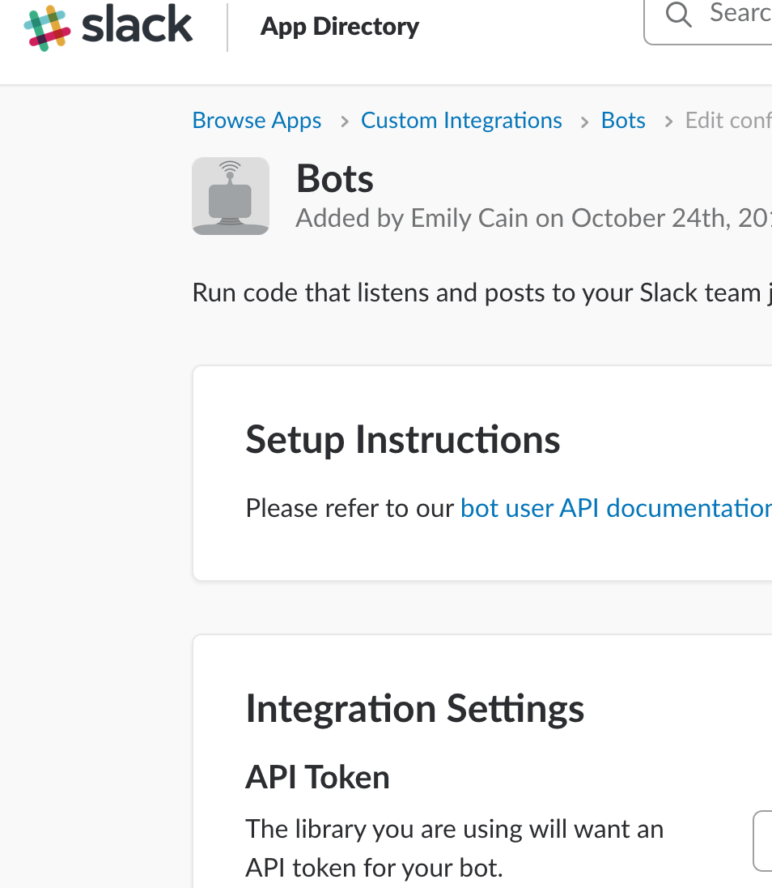
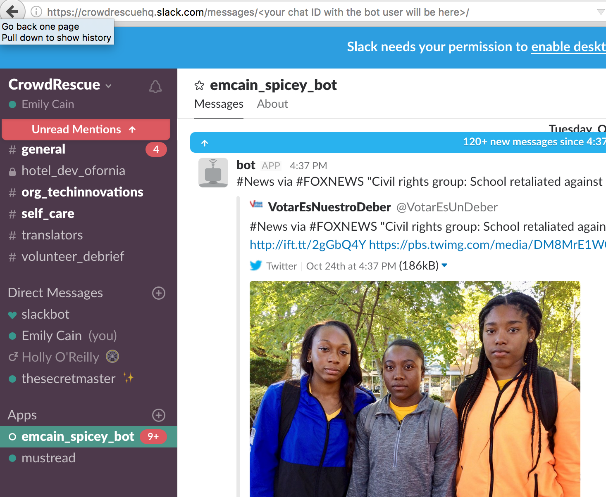

Social Precision Insight of Crowdsourced EmergencY - SPICEY
===========================================================

Setup
-----

SPICEYbot uses Python 2.7 -- there are some syntax issues that cause it not to work with Python 3.

Determine whether you are running Python 2 or Python 3 as the default Python version with

.. code-block:: bash

  $ python -v

You will need to create the virtualenv with Python 2. (Install Python 2.7 if you don't have it.)

Create a virtual environment for the project. If Python 2 is your default:

.. code-block:: bash

  $ virtualenv spicey_env -p

If Python 3 is your default:

.. code-block:: bash

  $ virtualenv spicey_env -p <path to Python 2 on your machine>

Once you have the virtual environment made, activate it.

.. code-block:: bash

  $ source spicey_env/bin/activate

Install the requirements in the activated virtual environment.

.. code-block:: bash

   $ pip install -r requirements.txt

Remember to reactivate the virtual environment any time you work on the project in the future.

Configuration
-------------

Twitter and Slack credentials are needed, create a ``settings.ini`` file with the following contents;

.. code-block:: bash

   [settings]
   TWITTER_KEY=<your-twitter-key>
   TWITTER_SECRET=<your-twitter-secret>
   TWITTER_ACCESS_TOKEN=<your access token>
   TWITTER_ACCESS_TOKEN_SECRET=<your access secret>
   SLACK_TOKEN=<your-slack-token>
   SLACK_CHANNEL=<channel name or id>
   DATABASE_NAME=spicey.db
   DATABASE_HOST=
   DATABASE_TABLE=messages
   DATABASE_USER=<type whatever you want your DB user to be called here>
   DATABASE_PASSWORD=<type whatever you want your DB password to be here>
   GEOLOCATION_BB=
   PRECLASSIFIED_FILE=train.csv

Replacing the ``<*>`` strings with relevant keys, secrets, and tokens--see the Slack Setup section below to learn how to get these for Slack.

To get a Twitter Key go to https://apps.twitter.com/ and create an app.  Use the
KEY and SECRET provided.

Slack Setup
-----------

To get a SLACK_TOKEN you will need to .. _`make a Slack bot user`:: https://api.slack.com/bot-users and give it permission to post in the Crowd Rescue Slack.

You will also need to copy the bot user's API token into settings.ini as SLACK_TOKEN.

For local testing, please authorize your bot to post in a private message with yourself. You can do this by:

* creating the bot user as specified in the link above
* sending a private message to the bot user to open a channel
* clicking on the private message channel with your bot user. Go to the URL bar and look for the chat's ID:

.. code-block
  https://crowdrescuehq.slack.com/messages/<your chat ID with the bot user will be here>/

* Then put the chat ID into setup.ini as SLACK_CHANNEL.

Running
-------

After you have done the above setup and activated your virtual environment, run:

.. code-block:: bash
  $ python spicey.py

It will connect to the social media channels, create a database, and begin posting to your Slack channel. Close the tab it's running in to kill the process.

  After about a minute tweets will be posted to the channel.  Tag correct tweets
  with :+1: and incorrect tweets with :-1:.  The bot will come back through and retrain
  base on the recommendation.

Deployment
----------

The run the deployment code script on server;

.. code-block:: bash

   $ /var/www/assistsearch/app/scripts/update.sh
